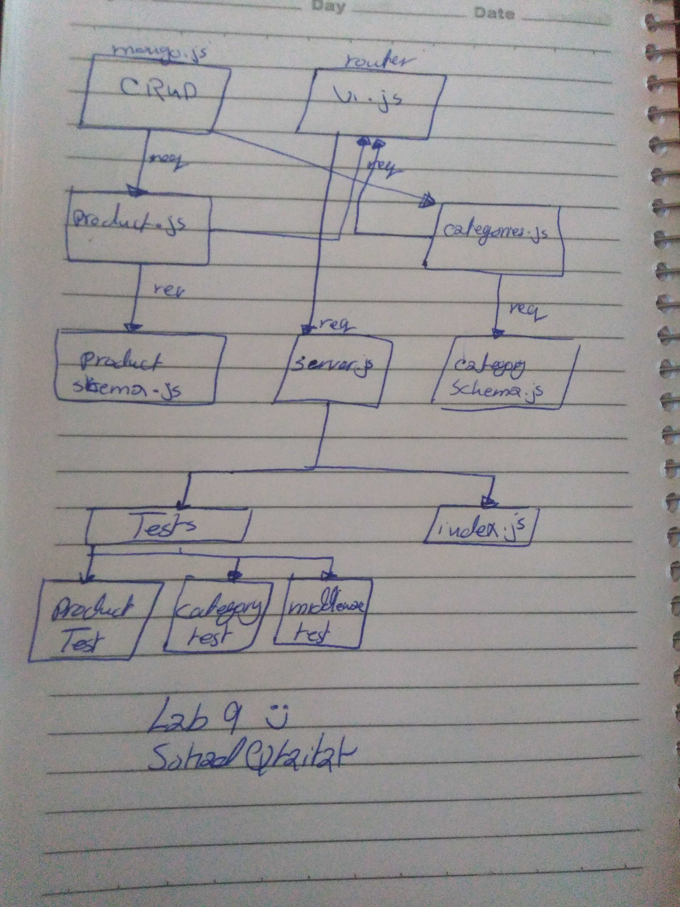

# Lab-09-API-Server
Lab-09-API-Server :low_brightness: :low_brightness: :low_brightness: :low_brightness:

### Author: sohad qtaitat

### Links and Resources
- [submission PR](https://github.com/401-advanced-javascript-sohad/Lab-09-API-Server/pull/3)
- [ci/cd](https://github.com/401-advanced-javascript-sohad/Lab-09-API-Server/actions) (GitHub Actions)

### Setup
- install the needed Dependencies JEST ESLINT CORS DOTENV MORGAN MONGOOSE EXPRESS SUPERTEST and use npm run test to run it 

#### `.env` requirements (where applicable)
i.e.
- `PORT` - Port Number
- `MONGODB_URI` - URL to the running mongo instance/db

#### How to initialize/run your application (where applicable)
- `npm run test`

#### Tests
- npm run test
- nodemon  

#### UML
